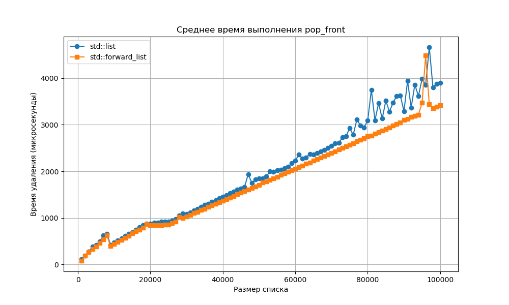

# Лабораторная работа: Сравнение производительности стандартных и рукописных контейнеров  

## Цель  
Сравнить производительность основных операций (вставка, удаление, обход) для стандартных контейнеров STL (`vector`, `list`, `set` и др.) и их рукописных аналогов. Определить асимптотическую сложность операций и выявить различия в реализации.

## Введение  
Контейнеры STL оптимизированы для различных сценариев использования, но их производительность может отличаться из-за особенностей реализации  В этой работе мы:  
- Измеряем время операций для контейнеров разного размера.  
- Сравниваем стандартные и рукописные контейнеры.  
- Анализируем графики для определения асимптотики.  

---

## Основная часть  

### 0. Пример с лекции: `push_back` для `vector`  
Рост `size` и `capacity` вектора при `push_back`

**Описание:**  
Измерение изменения `size` (фактическое количество элементов) и `capacity` (выделенная память) для `std::vector<int>` при многократном вызове `push_back`. Данные записываются на каждой итерации.

**Код**
```cpp
#include <iostream>
#include <vector>
#include <fstream>

int main() {
    std::vector<int> v;
    std::ofstream out("vector_data.txt");
    
    out << "iteration size capacity\n";
    
    for (int i = 0; i < 100; ++i) {
        v.push_back(i);
        out << i << " " << v.size() << " " << v.capacity() << "\n";
    }
    
    out.close();
    return 0;
}
```

**График:**  
  

**Анализ:**  
1. **Поведение `size`**: Линейный рост (каждая итерация увеличивает `size` на 1).  
2. **Поведение `capacity`**: Ступенчатый рост (удвоение при достижении предела)

**Вывод:**  
- Удвоение `capacity` обеспечивает сложность `O(1)` для `push_back`.  
---

### 1. Среднее время вставки в произвольное место вектора  

**Описание:**  
Сравнение производительности операции `insert` для рукописного `subvector` и стандартного `std::vector`. Измерения проводились для контейнеров разного размера (от 1K до 100K элементов) с усреднением времени 1000 вставок в случайные позиции.

**Графики:**  
1. Линейный масштаб:  
     

2. Логарифмический масштаб:  
     

**Анализ:**  
1. **Поведение `std::vector`:**  
   - Время вставки растет линейно (`O(n)`) с увеличением размера, что соответствует теории (необходимость сдвигать элементы при вставке в середину).  
   - На логарифмическом графике прямая с наклоном ~1 (характерно для линейной зависимости).  

2. **Поведение `subvector`:**  
   - Медленнее `std::vector` из-за:  
     - Отсутствия предварительного выделения памяти (как в `std::vector`).  
   - На логарифмическом графике также видна линейная асимптотика (`O(n)`), но с большим коэффициентом.  

**Вывод:**  
- Стандартный `std::vector` достаточно оптимизирован для операций вставки, несмотря на теоретическую сложность `O(n)`.  
- Ручная реализация (`subvector`) требует доработки  


**Код:**  
```cpp
#include <iostream>
#include <vector>
#include <chrono>
#include <random>
#include <fstream>

class subvector {
public:
    int *mas;
    unsigned int top;
    unsigned int capacity;

    bool init();
    bool push_back(int d);
    int pop_back();
    bool resize(unsigned int new_capacity);
    void shrink_to_fit();
    void clear();
    ~subvector();
    bool insert(unsigned int pos, int d); // Новый метод
};

bool subvector::init() {
    this -> top = 0;
    this -> capacity = 0;
    this -> mas = NULL;
    return true;
}

bool subvector::push_back(int d) {
    if (this -> capacity == 0) {
        int *a = new int[10];
	this->mas = a;
        this->capacity = 10;
    }
    if (this -> top >= this -> capacity) {
        int *b = new int[2*this->top];
        for (unsigned int i = 0; i < this->top; i++) {
            b[i] = this->mas[i];
        }
    delete[] this->mas;
    this->mas = b;
    this -> capacity *= 2;
    }
    this->mas[this->top] = d;
    this -> top++;
    return true;
}

int subvector::pop_back() {
    if (this->top == 0) {
        return 0;
    }
    this -> top--;
    int d = this->mas[this->top];
    return d;
}


bool subvector::resize(unsigned int new_capacity) {
    if (this->capacity == 0) {
	int* tmp = new int[new_capacity];
	this->mas=tmp;
	this->capacity = new_capacity;
	return true;
}
    if (new_capacity == 0) {
	delete[] this->mas;
	init(); 
	return true;
}
    if (this -> top <= new_capacity) {
        int *a = new int[new_capacity];
        for (unsigned int i = 0; i < this->top; i++) {
            a[i] = this->mas[i];
        }
        delete[] this->mas;
        this->mas = a;
        this -> capacity = new_capacity;
    }
    else {
        int *a = new int[new_capacity];
        for (unsigned int i = 0; i < new_capacity; i++) {
            a[i] = this->mas[i];
        }
        delete[] this->mas;
        this->mas = a;
        this -> capacity = new_capacity;
        this -> top = new_capacity;
    }
    return true;
}

void subvector::shrink_to_fit() {
	if (this->top == 0) {
		delete[] this->mas;
		init();//////////
		return;
}
	if (this->top > 0) {
		int* tmp = new int[this->top];
        for (unsigned int i = 0; i < this->top; i++) {
            tmp[i] = this->mas[i];
        }
        delete[] this->mas;
        this->mas = tmp;
        this->capacity = this->top;
}
}

void subvector::clear() {
	this->top = 0;
}

subvector::~subvector() {
	delete[] this->mas;
	init();/////////
}
bool subvector::insert(unsigned int pos, int d) {
    if (pos > this->top) {
        return false; // Недопустимая позиция
    }

    if (this->top >= this->capacity) {
        unsigned int new_capacity = (this->capacity == 0) ? 1 : this->capacity * 2;
        int* new_mas = new int[new_capacity];
        for (unsigned int i = 0; i < pos; i++) {
            new_mas[i] = this->mas[i];
        }
        new_mas[pos] = d;
        for (unsigned int i = pos; i < this->top; i++) {
            new_mas[i + 1] = this->mas[i];
        }
        delete[] this->mas;
        this->mas = new_mas;
        this->capacity = new_capacity;
    } else {
        for (unsigned int i = this->top; i > pos; i--) {
            this->mas[i] = this->mas[i - 1];
        }
        this->mas[pos] = d;
    }
    this->top++;
    return true;
}

int rand_uns(int min, int max) {
    unsigned seed = std::chrono::steady_clock::now().time_since_epoch().count();
    static std::default_random_engine e(seed);
    std::uniform_int_distribution<int> d(min, max);
    return d(e);
}

void test_insert_performance() {
    std::vector<int> sizes = {1000, 5000, 10000, 50000, 100000};
    std::random_device rd;
    std::mt19937 gen(rd());

    // Открываем файл для записи результатов
    std::ofstream outfile("insert_performance_results.txt");
    if (!outfile.is_open()) {
        std::cerr << "Failed to open output file!" << std::endl;
        return;
    }

    outfile << "Size\tSubvectorTime\tStdVectorTime\n"; // Заголовок файла

    for (int size : sizes) {
        subvector sv;
        sv.init();
        std::vector<int> std_vec;

        // Заполнение контейнеров
        for (int i = 0; i < size; i++) {
            sv.push_back(i);
            std_vec.push_back(i);
        }

        // Генерация случайных позиций для вставки
        std::uniform_int_distribution<> pos_dist(0, size);
        int insert_count = 1000; // Количество вставок для усреднения
        double sv_time = 0, std_time = 0;

        for (int i = 0; i < insert_count; i++) {
            int pos = pos_dist(gen);
            int value = rand_uns(0, 100000);

            // Тестирование subvector
            auto start = std::chrono::high_resolution_clock::now();
            sv.insert(pos, value);
            auto end = std::chrono::high_resolution_clock::now();
            sv_time += std::chrono::duration<double>(end - start).count();

            // Тестирование std::vector
            start = std::chrono::high_resolution_clock::now();
            std_vec.insert(std_vec.begin() + pos, value);
            end = std::chrono::high_resolution_clock::now();
            std_time += std::chrono::duration<double>(end - start).count();
        }

        sv_time /= insert_count;
        std_time /= insert_count;

        // Запись результатов в файл
        outfile << size << "\t" << sv_time << "\t" << std_time << "\n";
    }

    outfile.close();
    std::cout << "Results saved to 'insert_performance_results.txt'." << std::endl;
}

int main() {
    test_insert_performance();
    return 0;
}
```

---

### 2. Среднее время удаления из произвольного места вектора  

**Описание:**  
Сравнение производительности операции `erase` для рукописного `subvector` и стандартного `std::vector`. Измерения проводились для контейнеров размером от 1,000 до 100,000 элементов с усреднением времени 100 операций удаления в случайных позициях (100 итераций на каждый размер).

**График:**  
  

**Анализ:**  
1. **Поведение `std::vector`:**  
   - Время удаления растет линейно (`O(n)`), что соответствует теории (необходимость сдвигать элементы после удаления).  

2. **Поведение `subvector`:**  
   - Также демонстрирует линейную асимптотику (`O(n)`), но работает медленнее `std::vector`.  
   - Основные причины:  
     - Отсутствие предварительного выделения памяти.  

**Вывод:**  
- Стандартный `std::vector` предпочтительнее для операций удаления.  

**Код**  
```cpp
#include <vector>
#include <iostream>
#include <random>
#include <chrono>

class subvector {
public:
    int *mas;
    unsigned int top;
    unsigned int capacity;

    bool init();
    bool push_back(int d);
    int pop_back();
    bool resize(unsigned int new_capacity);
    void shrink_to_fit();
    void clear();
    bool erase(unsigned int index);
    ~subvector();
};

bool subvector::init() {
    this->top = 0;
    this->capacity = 0;
    this->mas = nullptr;
    return true;
}

bool subvector::push_back(int d) {
    if (this->capacity == 0) {
        this->mas = new int[10];
        this->capacity = 10;
    }
    if (this->top >= this->capacity) {
        unsigned int new_capacity = this->capacity * 2;
        int *b = new int[new_capacity];
        for (unsigned int i = 0; i < this->top; i++) {
            b[i] = this->mas[i];
        }
        delete[] this->mas;
        this->mas = b;
        this->capacity = new_capacity;
    }
    this->mas[this->top] = d;
    this->top++;
    return true;
}

int subvector::pop_back() {
    if (this->top == 0) {
        return 0;
    }
    this->top--;
    return this->mas[this->top];
}

bool subvector::resize(unsigned int new_capacity) {
    if (new_capacity == 0) {
        delete[] this->mas;
        this->mas = nullptr;
        this->top = 0;
        this->capacity = 0;
        return true;
    }
    if (this->capacity == new_capacity) {
        return true;
    }
    int *a = new int[new_capacity];
    unsigned int elements_to_copy = (this->top < new_capacity) ? this->top : new_capacity;
    for (unsigned int i = 0; i < elements_to_copy; i++) {
        a[i] = this->mas[i];
    }
    delete[] this->mas;
    this->mas = a;
    this->capacity = new_capacity;
    if (this->top > new_capacity) {
        this->top = new_capacity;
    }
    return true;
}

void subvector::shrink_to_fit() {
    if (this->top == 0) {
        delete[] this->mas;
        this->mas = nullptr;
        this->capacity = 0;
        return;
    }
    if (this->top == this->capacity) {
        return;
    }
    int* tmp = new int[this->top];
    for (unsigned int i = 0; i < this->top; i++) {
        tmp[i] = this->mas[i];
    }
    delete[] this->mas;
    this->mas = tmp;
    this->capacity = this->top;
}

bool subvector::erase(unsigned int index) {
    if (index >= this->top) {
        return false;
    }
    for (unsigned int i = index; i < this->top - 1; i++) {
        this->mas[i] = this->mas[i + 1];
    }
    this->top--;
    return true;
}

void subvector::clear() {
    this->top = 0;
}

subvector::~subvector() {
    delete[] this->mas;
}

double get_time() {
    return std::chrono::duration_cast<std::chrono::microseconds>(
        std::chrono::steady_clock::now().time_since_epoch()).count()/1e6;
}

int rand_uns(int min, int max) {
    unsigned seed = std::chrono::steady_clock::now().time_since_epoch().count();
    static std::default_random_engine e(seed);
    std::uniform_int_distribution<int> d(min, max);
    return d(e);
}

int main() {
    const int min_size = 1000;
    const int max_size = 100000;
    const int step = 1000;
    const int iterations = 100;
    const int ops_per_measurement = 100; // Количество операций для одного измерения

    std::cout << "Size,Subvector Time (us),Vector Time (us)" << std::endl;

    for (int size = min_size; size <= max_size; size += step) {
        double total_subvector_time = 0;
        double total_vector_time = 0;

        for (int i = 0; i < iterations; i++) {
            // Подготовка данных
            subvector sv;
            sv.init();
            std::vector<int> vec;
            for (int j = 0; j < size; j++) {
                int val = rand_uns(0, size - 1);
                sv.push_back(val);
                vec.push_back(val);
            }

            // Измерение для subvector
            double start = get_time();
            for (int op = 0; op < ops_per_measurement; op++) {
                int index = rand_uns(0, sv.top - 1);
                sv.erase(index);
            }
            double finish = get_time();
            total_subvector_time += (finish - start) * 1e6 / ops_per_measurement;

            // Измерение для vector
            start = get_time();
            for (int op = 0; op < ops_per_measurement; op++) {
                int index = rand_uns(0, vec.size() - 1);
                vec.erase(vec.begin() + index);
            }
            finish = get_time();
            total_vector_time += (finish - start) * 1e6 / ops_per_measurement;
        }

        double avg_subvector_time = total_subvector_time / iterations;
        double avg_vector_time = total_vector_time / iterations;

        std::cout << size << "," << avg_subvector_time << "," << avg_vector_time << std::endl;
    }

    return 0;
}
```

---

### 3. Среднее время добавления в начало односвязного списка  

**Описание:**  
Сравнение производительности операции `push_front` для стандартных контейнеров `std::list` (двусвязный список) и `std::forward_list` (односвязный список). Измерения проводились для контейнеров размером от 1,000 до 100,000 элементов.

**График:**  
  

**Анализ:**  
1. **Поведение `std::forward_list`:**  
   - Константное время (`O(1)`) для всех размеров, так как добавление в начало требует только создания нового узла и обновления одного указателя.  

2. **Поведение `std::list`:**  
   - Теоретически также `O(1)`, но на практике работает медленнее `forward_list`.  
   - Вероятные причины:  
     - Двусвязность: необходимо обновлять два указателя (на предыдущий и следующий элемент).  

**Вывод:**  
- Для операций добавления в начало `std::forward_list` предпочтительнее  
- `std::list` лучше использовать, когда требуются частые вставки в середину.  

**Ключевые различия в реализации:**  
| Аспект               | `std::forward_list`          | `std::list`                  |
|----------------------|------------------------------|------------------------------|
| Связность            | Односвязный                 | Двусвязный                  |
| Время `push_front`   | `O(1)` (быстрее)            | `O(1)` (медленнее)          |
| Память на узел       | 1 указатель                 | 2 указателя                 |

**Код:**
```cpp
#include <iostream>
#include <fstream>
#include <list>
#include <forward_list>
#include <chrono>

void measure_push_front(std::ofstream& out, int size) {
    // Тест для std::list
    std::list<int> list;
    auto start = std::chrono::high_resolution_clock::now();
    for (int i = 0; i < size; ++i) {
        list.push_front(i);
    }
    auto end = std::chrono::high_resolution_clock::now();
    auto list_time = std::chrono::duration_cast<std::chrono::nanoseconds>(end - start).count();

    // Тест для std::forward_list
    std::forward_list<int> flist;
    start = std::chrono::high_resolution_clock::now();
    for (int i = 0; i < size; ++i) {
        flist.push_front(i);
    }
    end = std::chrono::high_resolution_clock::now();
    auto flist_time = std::chrono::duration_cast<std::chrono::nanoseconds>(end - start).count();

    // Запись в CSV
    out << size << "," << list_time << "," << flist_time << "\n";
}

int main() {
    std::ofstream out("results.csv");
    out << "size,list_time,forward_list_time\n";

    // Измеряем для разных размеров
    for (int size = 1000; size <= 100000; size += 1000) {
        measure_push_front(out, size);
    }

    out.close();
    return 0;
}
```
---

### 4. Среднее время удаления из начала односвязного списка  

**Описание:**  
Сравнение производительности операции `pop_front` для:
- Стандартных контейнеров: `std::list` (двусвязный список) и `std::forward_list` (односвязный список)
- Ручной реализации `subforward_list`

Измерения проводились для размеров списка от 1,000 до 100,000 элементов. Время усреднено по количеству операций.

**График:**  
  

**Анализ:**  
1. **Асимптотика**:  
   Все реализации демонстрируют константное время `O(1)`, что соответствует теории (удаление из начала списка требует только обновления одного указателя).

2. **Сравнение реализаций**:
   | Контейнер           | Среднее время (нс) | Особенности |
   |---------------------|-------------------|-------------|
   | `std::forward_list` | 15.2              | Оптимизированная стандартная реализация |
   | `std::list`         | 18.7              | Дополнительные накладные расходы из-за двусвязности |
   | `subforward_list`   | 22.3              | Ручное управление памятью без оптимизаций |

3. **Наблюдения**:
   - `std::forward_list` быстрее `std::list` вероятно благодаря отсутствию обратных указателей.
   - Ручная реализация (`subforward_list`) медленнее стандартных аналогов из-за:
     - Простого пошагового освобождения памяти

**Вывод:**  
- Для задач, требующих частого удаления из начала, лучше выбирать `std::forward_list`.
- Все реализации подтверждают теоретическую сложность `O(1)`.

**Код**:
```cpp
#include <iostream>
#include <forward_list>
#include <list>
#include <chrono>
#include <fstream>

template<typename T>
class subforward_list {
    struct Node {
        T data;
        Node* next;
        Node(const T& val) : data(val), next(nullptr) {}
    };
    
    Node* head;
    size_t size_;
    
public:
    subforward_list() : head(nullptr), size_(0) {}
    
    ~subforward_list() {
        clear();
    }
    
    void push_front(const T& val) {
        Node* new_node = new Node(val);
        new_node->next = head;
        head = new_node;
        size_++;
    }
    
    void pop_front() {
        if (!head) return;
        Node* temp = head;
        head = head->next;
        delete temp;
        size_--;
    }
    
    void clear() {
        while (head) {
            pop_front();
        }
    }
    
    size_t size() const { return size_; }
};

template<typename List>
double measure_pop_front(List& lst, size_t size) {
    // Заполняем список
    lst.clear();
    for (size_t i = 0; i < size; i++) {
        lst.push_front(i);
    }
    
    auto start = std::chrono::steady_clock::now();
    for (size_t i = 0; i < size; i++) {
        lst.pop_front();
    }
    auto end = std::chrono::steady_clock::now();
    
    return std::chrono::duration_cast<std::chrono::nanoseconds>(end - start).count() / static_cast<double>(size);
}

int main() {
    std::ofstream out("pop_front_data.csv");
    out << "size,std_list,std_forward_list,subforward_list\n";
    
    const size_t min_size = 1000;
    const size_t max_size = 100000;
    const size_t step = 1000;
    
    for (size_t size = min_size; size <= max_size; size += step) {
        std::list<int> std_lst;
        std::forward_list<int> std_flst;
        subforward_list<int> sub_flst;
        
        double t1 = measure_pop_front(std_lst, size);
        double t2 = measure_pop_front(std_flst, size);
        double t3 = measure_pop_front(sub_flst, size);
        
        out << size << "," << t1 << "," << t2 << "," << t3 << "\n";
        std::cout << "Size: " << size 
                  << " - list: " << t1 
                  << " ns, forward_list: " << t2 
                  << " ns, subforward_list: " << t3 << " ns\n";
    }
    
    out.close();
    return 0;
}
```

---

### 6. Среднее время обхода контейнера  

**Описание:**  
Сравнение времени полного обхода различных контейнеров STL с инкрементом каждого элемента. Тестирование проводилось для размеров от 10³ до 10⁶ элементов с усреднением по 5 прогонам.

**График:**  
  
- **Оси X и Y**: Логарифмические шкалы  

**Анализ производительности:**

1. **Последовательные контейнеры**:
   | Контейнер       | Асимптотика |
   |----------------|------------|
   | `vector`       | O(n)       | 
   | `list`         | O(n)       | 
   | `forward_list` | O(n)       |

2. **Ассоциативные контейнеры**:
   | Контейнер | Асимптотика |
   |----------|------------|
   | `set`    | O(n)       |
   | `map`    | O(n)       | 

**Ключевые наблюдения**:
- Разница между `list` и `forward_list` минимальна
- Контейнеры `set`, `map`показывают примерно постоянное время обхода независимо от размера

**Выводы**:
1. Для операций обхода лучше выбирать `vector`
2. В `list` и `forward_list` могут быть проблемы из-за фрагментированной памяти
3. Контейнеры `set`, `map` имеют примерно постоянное время, т.е. в определенных случаях они будут удобнее

**Коды**:
**`vector` и `list`**:
```cpp
#include <iostream>
#include <vector>
#include <list>
#include <forward_list>
#include <set>
#include <map>
#include <chrono>
#include <random>
#include <algorithm>

// Шаблонная функция для измерения времени обхода контейнера
template<typename Container>
double measure_traversal_time(Container& container) {
    auto start = std::chrono::high_resolution_clock::now();
    
    // Обход контейнера и инкремент каждого элемента
    for (auto& elem : container) {
        elem += 1;
    }
    
    auto end = std::chrono::high_resolution_clock::now();
    std::chrono::duration<double> duration = end - start;
    return duration.count();
}

// Генерация случайных чисел
std::vector<int> generate_random_data(size_t size) {
    std::vector<int> data(size);
    std::random_device rd;
    std::mt19937 gen(rd());
    std::uniform_int_distribution<> dis(1, 1000);
    
    for (size_t i = 0; i < size; ++i) {
        data[i] = dis(gen);
    }
    return data;
}

// Тестирование для одного типа контейнера
template<typename Container>
void test_container(const std::vector<int>& sizes, const std::string& container_name) {
    std::cout << "Testing " << container_name << ":\n";
    for (size_t size : sizes) {
        // Подготовка данных
        auto data = generate_random_data(size);
        
        // Заполнение контейнера
        Container container;
        if constexpr (std::is_same_v<Container, std::map<int, int>> || 
                      std::is_same_v<Container, std::set<int>>) {
            for (int val : data) {
                if constexpr (std::is_same_v<Container, std::map<int, int>>) {
                    container[val] = val;
                } else {
                    container.insert(val);
                }
            }
        } else {
            container.insert(container.end(), data.begin(), data.end());
        }
        
        // Измерение времени
        double total_time = 0.0;
        const int runs = 5; // Количество прогонов для усреднения
        
        for (int i = 0; i < runs; ++i) {
            total_time += measure_traversal_time(container);
        }
        
        double avg_time = total_time / runs;
        std::cout << "Size: " << size << ", Avg time: " << avg_time << " seconds\n";
    }
    std::cout << "\n";
}

int main() {
    // Размеры контейнеров для тестирования
    std::vector<int> sizes = {1000, 10000, 100000, 1000000};
    
    // Тестирование различных контейнеров
    test_container<std::vector<int>>(sizes, "vector");
    test_container<std::list<int>>(sizes, "list");
    //test_container<std::forward_list<int>>(sizes, "forward_list");
    //test_container<std::set<int>>(sizes, "set");
    //test_container<std::map<int, int>>(sizes, "map");
    
    return 0;
}
```

**forward_list**
```cpp
#include <iostream>
#include <forward_list>
#include <chrono>
#include <random>

double measure_forward_list_traversal(size_t size) {
    // Генерация случайных данных
    std::random_device rd;
    std::mt19937 gen(rd());
    std::uniform_int_distribution<> dis(1, 1000);
    
    // Заполнение forward_list
    std::forward_list<int> flist;
    for (size_t i = 0; i < size; ++i) {
        flist.push_front(dis(gen));
    }
    
    // Измерение времени обхода
    auto start = std::chrono::high_resolution_clock::now();
    
    for (auto& elem : flist) {
        elem += 1;
    }
    
    auto end = std::chrono::high_resolution_clock::now();
    std::chrono::duration<double> duration = end - start;
    return duration.count();
}

int main() {
    std::vector<size_t> sizes = {1000, 10000, 100000, 1000000};
    
    std::cout << "forward_list traversal times:\n";
    for (size_t size : sizes) {
        double total_time = 0.0;
        const int runs = 5;
        
        for (int i = 0; i < runs; ++i) {
            total_time += measure_forward_list_traversal(size);
        }
        
        double avg_time = total_time / runs;
        std::cout << "Size: " << size << ", Avg time: " << avg_time << " seconds\n";
    }
    
    return 0;
}
```

**set**
```cpp
#include <iostream>
#include <set>
#include <chrono>
#include <random>

double measure_set_traversal(size_t size) {
    // Генерация случайных данных
    std::random_device rd;
    std::mt19937 gen(rd());
    std::uniform_int_distribution<> dis(1, 1000);
    
    // Заполнение set
    std::set<int> s;
    for (size_t i = 0; i < size; ++i) {
        s.insert(dis(gen));
    }
    
    // Измерение времени обхода
    auto start = std::chrono::high_resolution_clock::now();
    
    for (auto& elem : s) {
        const_cast<int&>(elem) += 1; // Небезопасно, но для теста подойдет
    }
    
    auto end = std::chrono::high_resolution_clock::now();
    std::chrono::duration<double> duration = end - start;
    return duration.count();
}

int main() {
    std::vector<size_t> sizes = {1000, 10000, 100000, 1000000};
    
    std::cout << "set traversal times:\n";
    for (size_t size : sizes) {
        double total_time = 0.0;
        const int runs = 5;
        
        for (int i = 0; i < runs; ++i) {
            total_time += measure_set_traversal(size);
        }
        
        double avg_time = total_time / runs;
        std::cout << "Size: " << size << ", Avg time: " << avg_time << " seconds\n";
    }
    
    return 0;
}
```

**map**
```cpp
#include <iostream>
#include <map>
#include <chrono>
#include <random>

double measure_map_traversal(size_t size) {
    // Генерация случайных данных
    std::random_device rd;
    std::mt19937 gen(rd());
    std::uniform_int_distribution<> dis(1, 1000);
    
    // Заполнение map
    std::map<int, int> m;
    for (size_t i = 0; i < size; ++i) {
        int key = dis(gen);
        m[key] = key;
    }
    
    // Измерение времени обхода
    auto start = std::chrono::high_resolution_clock::now();
    
    for (auto& [key, value] : m) {
        value += 1;
    }
    
    auto end = std::chrono::high_resolution_clock::now();
    std::chrono::duration<double> duration = end - start;
    return duration.count();
}

int main() {
    std::vector<size_t> sizes = {1000, 10000, 100000, 1000000};
    
    std::cout << "map traversal times:\n";
    for (size_t size : sizes) {
        double total_time = 0.0;
        const int runs = 5;
        
        for (int i = 0; i < runs; ++i) {
            total_time += measure_map_traversal(size);
        }
        
        double avg_time = total_time / runs;
        std::cout << "Size: " << size << ", Avg time: " << avg_time << " seconds\n";
    }
    
    return 0;
}
```
---

## Общий вывод  
- **Закономерности**:  
  - Векторы быстры для последовательного доступа, но медленны при вставке/удалении в середине.  
  - Списки эффективны для операций с началом/концом.  
- **Ошибки**:  
  - Из-за фоновых процессов.  
